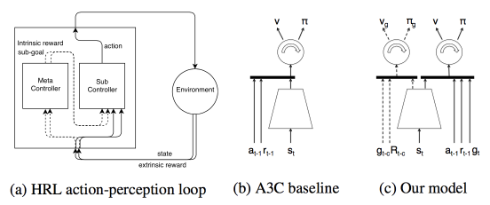
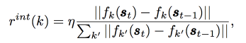
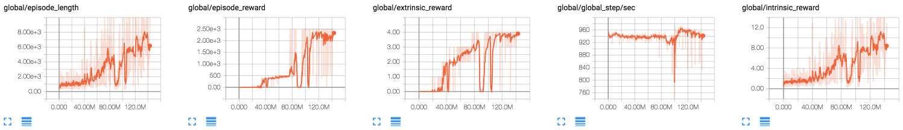
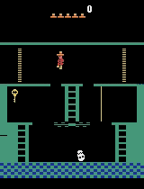
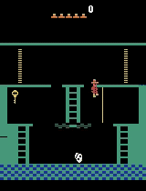
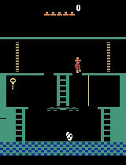

# FeatureControlHRL-Tensorflow

As part of the implementation series of [Joseph Lim's group at USC](http://csail.mit.edu/~lim), our motivation is to accelerate (or sometimes delay) research in the AI community by promoting open-source projects. To this end, we implement state-of-the-art research papers, and publicly share them with concise reports. Please visit our [group github site](https://github.com/gitlimlab) for other projects.

This project is implemented by [Youngwoon Lee](https://github.com/youngwoon) and the codes have been reviewed by [Shao-Hua Sun](https://github.com/shaohua0116) before being published.

## Description
This repo is a [Tensorflow](https://www.tensorflow.org/) implementation of Feature-control and Pixel-control agents on Montezuma's Revenge: [Feature Control as Intrinsic Motivation for Hierarchical Reinforcement Learning](https://arxiv.org/abs/1705.06769).

This paper presents a hierarchical reinforcement learning framework, which tackles a task with sparse rewards by extracting intrinsic rewards from changes in consecutive observations. The motivation of this paper is that given an intention of the agent the model can learn a feature that judges whether the intention is achieved or not. In other workds, the agent learns a set of skills that change future observations in a certain direction. For example, one skill we want to learn in Montezuma's Revenge is catching a key. The success of this skill can be judged by the presence of the key. If we succeed to remove a key in the observation, we can get reward since the presence of the key changes. These skills are called subgoals of the meta-controller.



The proposed model consists of two controllers, meta-controller and sub-controller. The meta-controller sets a subgoal that wants to achieve for the next 100 timesteps. Then the sub-controller finds the optimal actions to accomplish the subgoal. The meta-controller decides the next subgoal based on the previous subgoal, the current observation, and the rewards for the last subgoal. Then the actions are computed using the previous reward, the previous action, and the current observation. To capture the temporal information, the policy networks of meta-controller and sub-controller use LSTM.

The intrinsic reward of feature-control agent is the relative changes in two consecutive frames' k-th feature map over all feature maps on the second convolutional layer. The paper also proposes pixel-control agent which computes intrinsic reward based on the pixel value changes in a certain region. This is in-progress and will be release soon.



This method reaches to 2500 score for Montezuma's Revenge-v0 which outperforms the-state-of-the-art method (Feudal Network).

## Dependencies

- Ubuntu 16.04
- Python 3.6
- [tmux](https://tmux.github.io)
- [htop](https://hisham.hm/htop)
- [Tensorflow 1.3.0](https://www.tensorflow.org/)
- [Universe](https://github.com/openai/universe)
- [gym](https://github.com/openai/gym)
- [tqdm](https://github.com/tqdm/tqdm)

## Usage

- Execute the following command to train a model:

```
$ python train.py --log-dir='/tmp/feature-control' --intrinsic-type='feature'
```

- Once training is ended, you can test the agent will play the game 10 times and show the average reward.

```
$ python test.py --log-dir='/tmp/feature-control' --visualise
```

- Check the training status on Tensorboard. The default port number is 12345 (i.e. http://localhost:12345).


## Results

### Montezuma's Revenge-v0



### Videos

| Iterations |                   10M                    |                   27M                    |                   50M                    |                   90M                    |                   160M                   |
| :--------: | :--------------------------------------: | :--------------------------------------: | :--------------------------------------: | :--------------------------------------: | :--------------------------------------: |
|  Rewards   |                    0                     |                   100                    |                   500                    |                    0                     |                   2500                   |
|   Videos   |  |  |  |  |  |


## References

- [Feature Control as Intrinsic Motivation for Hierarchical Reinforcement Learning](https://arxiv.org/abs/1705.06769)
- The A3C implementation is from OpenAI's code: https://github.com/openai/universe-starter-agent

