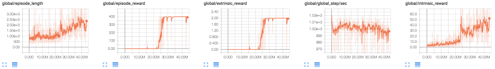

# Feature Control as Intrinsic Motivation for Hierarchical RL in Tensorflow

As part of the implementation series of [Joseph Lim's group at USC](http://www-bcf.usc.edu/~limjj/), our motivation is to accelerate (or sometimes delay) research in the AI community by promoting open-source projects. To this end, we implement state-of-the-art research papers, and publicly share them with concise reports. Please visit our [group github site](https://github.com/gitlimlab) for other projects.

This project is implemented by [Youngwoon Lee](https://github.com/youngwoon) and the codes have been reviewed by [Shao-Hua Sun](https://github.com/shaohua0116) before being published.

## Description
This repo is a [Tensorflow](https://www.tensorflow.org/) implementation of Feature-control and Pixel-control agents on Montezuma's Revenge: [Feature Control as Intrinsic Motivation for Hierarchical Reinforcement Learning](https://arxiv.org/abs/1705.06769).

This paper focuses on solving hierarchical reinforcement learning (HRL), where a task can be decomposed into a hierarchy of subproblems or subtasks such that higher-level parent-tasks invoke lower-level child tasks as if they were primitive actions. To tackle this problem, this paper presents a HRL framework which is able to overcome the issue of sparse rewards by extracting intrinsic rewards from changes in consecutive observations. The motivation of this paper is that given an intention of an agent a model learns a set of features, each of which can judge whether the corresponding intention is achieved or not. In other words, the agent learns a set of skills that change future observations in a certain direction. For example, one skill we want to learn in Montezuma's Revenge is catching a key. The success of this skill can be judged by the presence of the key. If we succeed to remove the key from the observation, we can get reward since the presence of the key is changed. These skills are called subgoals of the meta-controller.

<p align="center">
    
</p>

The proposed model consists of two controllers, which are meta-controller and sub-controller. As a high-level planner, the meta-controller sets a subgoal that wants to achieve for the next 100 timesteps; on the other hand, the sub-controller aims to figure out the optimal action sequences to accomplish this subgoal. The meta-controller decides the next subgoal based on the previous subgoal, the current observation, and the reward it gathered during the previous subgoal. Then the actions are computed using the previous reward, the previous action, and the current observation. To capture temporal information, policy networks of the meta-controller and the sub-controller use LSTMs.

The intrinsic reward of a feature-control agent is the relative changes in two consecutive frames' k-th feature map over all feature maps on the second convolutional layer. The paper also proposes a pixel-control agent which computes intrinsic reward based on the pixel value changes in a certain region, which is also included in this repo. 

<p align="center">
    
</p>

This method outperforms the state-of-the-art method (Feudal Network) and reaches to 2500 score on Montezuma's Revenge-v0.

## Dependencies

- Ubuntu 16.04
- Python 3.6
- [tmux](https://tmux.github.io)
- [htop](https://hisham.hm/htop)
- [Tensorflow 1.3.0](https://www.tensorflow.org/)
- [Universe](https://github.com/openai/universe)
- [gym](https://github.com/openai/gym)
- [tqdm](https://github.com/tqdm/tqdm)

## Usage

- Execute the following command to train a model:

```
$ python train.py --log-dir='/tmp/feature-control' --intrinsic-type='feature' --bptt=100
```

- `intrinsic-type` can be either `'feature'` or `'pixel'`

- With `--bptt` option you can choose 20 or 100 time steps as a bptt.

- Once training is ended, you can test the agent will play the game 10 times and show the average reward.

```
$ python test.py --log-dir='/tmp/feature-control' --intrinsic-type='feature' --bptt=100 --visualise
```

- Check the training status on Tensorboard. The default port number is 12345 (i.e. http://localhost:12345).


## Results

### Montezuma's Revenge-v0

- Feature-control agent with bptt 100


- Pixel-control agent with bptt 100


- The training speed shows slower convergence speed compared to the result reported in the paper. Be patient and keep training an agent until 20M iterations.

### Videos (Feature-control agent)

| Iterations |                   10M                    |                   27M                    |                   50M                    |                   90M                    |                   160M                   |
| :--------: | :--------------------------------------: | :--------------------------------------: | :--------------------------------------: | :--------------------------------------: | :--------------------------------------: |
|  Rewards   |                    0                     |                   100                    |                   400                    |                    0                     |                   2500                   |
|   Videos   |  |  |  |  |  |


## References

- [Feature Control as Intrinsic Motivation for Hierarchical Reinforcement Learning](https://arxiv.org/abs/1705.06769)
- [The A3C implementation by OpenAI's code](https://github.com/openai/universe-starter-agent)
- [FeUdal Networks for Hierarchical Reinforcement Learning](https://arxiv.org/abs/1703.01161)
